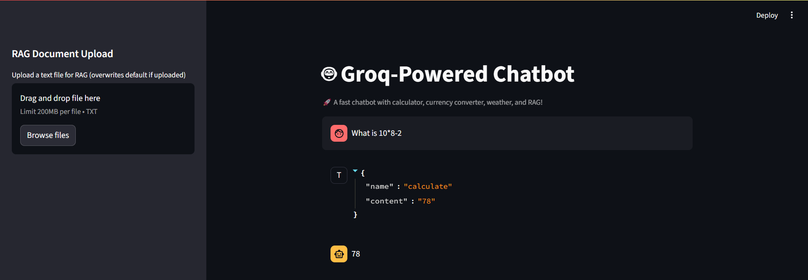

# 🤖 Groq-Powered Chatbot with Tools & RAG (Streamlit App)

A fast and versatile AI chatbot built with Groq's API, featuring dynamic tool calling (calculator, currency converter, weather forecaster) and a Retrieval Augmented Generation (RAG) system for custom knowledge base queries, all deployed via Streamlit.

## ✨ Features

- **⚡ Blazing Fast Responses:** Leveraging Groq's high-performance LLMs for quick interactions.
- **🛠️ Tool Calling:**
  - **Calculator:** Perform basic arithmetic operations.
  - **Currency Converter:** Get real-time exchange rates (powered by fxratesapi.com).
  - **Weather Forecaster:** Get current weather conditions for any location (powered by OpenWeatherMap/WeatherAPI.com).
- **📚 Retrieval Augmented Generation (RAG):** Answer questions based on custom, provided documentation (e.g., movie descriptions) to overcome LLM knowledge cutoffs.
- **⬆️ Dynamic Knowledge Base:** Upload your own text files via the Streamlit UI to instantly update the RAG system's knowledge.
- **🌐 Streamlit UI:** User-friendly web interface for easy interaction and deployment.

## 🚀 Getting Started

Follow these steps to set up and run the chatbot locally or deploy it.

### Prerequisites

- Python 3.8+
- `pip` (Python package installer)
- Git (for cloning the repository)

### API Keys Required

You'll need API keys from the following services:

1.  **Groq API Key:**
    - Sign up/log in at [console.groq.com](https://console.groq.com/).
    - Generate and copy your API key.
2.  **FXRatesAPI Key:**
    - Sign up/log in at [fxratesapi.com](https://fxratesapi.com/).
    - Obtain your API key.
3.  **Weather API Key (e.g., OpenWeatherMap or WeatherAPI.com):**
    - For **OpenWeatherMap**: Sign up at [openweathermap.org](https://openweathermap.org/) and generate your API key. (Recommended alternative if WeatherAPI.com causes issues).
    - For **WeatherAPI.com**: Sign up at [weatherapi.com](https://www.weatherapi.com/) and obtain your API key.

### Local Setup

1.  **Clone the Repository:**

    ```bash
    git clone [https://github.com/YOUR_GITHUB_USERNAME/chatbot_project.git](https://github.com/YOUR_GITHUB_USERNAME/chatbot_project.git)
    cd chatbot_project
    ```

    (Replace `YOUR_GITHUB_USERNAME` with your actual GitHub username and `chatbot_project` with your repository name if different).

2.  **Create a Virtual Environment (Recommended):**

    ```bash
    python -m venv venv
    ```

3.  **Activate the Virtual Environment:**

    - **On macOS/Linux:**
      ```bash
      source venv/bin/activate
      ```
    - **On Windows (Command Prompt):**
      ```cmd
      venv\Scripts\activate.bat
      ```
    - **On Windows (PowerShell):**
      ```powershell
      .\venv\Scripts\Activate.ps1
      ```

4.  **Create a `.env` file:**
    Create a file named `.env` in the `chatbot_project/` directory with your API keys:

    ```env
    GROQ_API_KEY="YOUR_GROQ_API_KEY"
    FXRATESAPI_API_KEY="YOUR_FXRATESAPI_API_KEY"
    # Use the appropriate key based on your choice (OpenWeatherMap or WeatherAPI.com)
    OPENWEATHERMAP_API_KEY="YOUR_OPENWEATHERMAP_API_KEY" # Or WEATHERAPI_API_KEY="..."
    ```

    **Replace the placeholder values with your actual API keys.**

5.  **Install Dependencies:**

    ```bash
    pip install -r requirements.txt
    ```

6.  **Run the Streamlit Application:**
    ```bash
    streamlit run main.py
    ```
    This will open the chatbot in your default web browser.

### 💡 Usage Examples

Once the app is running, try asking:

- **Calculator:** "What is 10 + 5 \* 2?"
- **Currency Converter:** "Convert 100 USD to INR."
- **Weather Forecaster:** "What's the weather like in London?"
- **RAG (Movie Info):** "Who directed The Matrix?"
- **General Chat:** "Tell me a joke."

You can also upload your own text file in the sidebar to add custom knowledge to the RAG system.

## 📸 Screenshots

Here are some glimpses of the chatbot in action:

### Main Chat Interface

_A general view of the chatbot's main conversation window._

### Calculator Tool

_Performing a mathematical calculation._

### RAG Query Example
.png)
_Demonstrating retrieval augmented generation from the txt file uploaded._
### 📁 Project Folder Structure

**`main.py`**  
The main file that runs the chatbot using Streamlit.

**`tools.py`**  
Contains the logic for external tools:
- Calculator
- Currency converter
- Weather fetcher

**`rag_system.py`**  
Handles the RAG (Retrieval-Augmented Generation) pipeline:
- Splits documents into chunks
- Creates embeddings
- Searches using FAISS for relevant content

**`documents/`**  
A folder that stores your knowledge base files.  
Includes:  
- `your_knowledge_base.txt` → A text file used for answering questions.

**`.env`**  
Stores API keys (like weather or currency APIs).  
This file is ignored by Git for security.

**`.gitignore`**  
Specifies files and folders that Git should ignore (e.g., `.env`).

**`requirements.txt`**  
Lists all the Python packages required to run the project.


## ☁️ Deployment on Streamlit Community Cloud

1.  **GitHub Repository:** Ensure your project is pushed to a public GitHub repository. (If you followed the local setup, you'll do this in the next step).
2.  **Streamlit Cloud Secrets:** Instead of a `.env` file, Streamlit Community Cloud uses "Secrets" for environment variables.
    - Go to [share.streamlit.io](https://share.streamlit.io/).
    - Select your app, then navigate to "Settings" > "Secrets".
    - Add each API key as a new secret, e.g.:
      ```
      GROQ_API_KEY="YOUR_GROQ_API_KEY"
      FXRATESAPI_API_KEY="YOUR_FXRATESAPI_API_KEY"
      OPENWEATHERMAP_API_KEY="YOUR_OPENWEATHERMAP_API_KEY" # Or WEATHERAPI_API_KEY
      ```
3.  **Deploy:** From the Streamlit Community Cloud dashboard, select "New app," point it to your GitHub repository and `main.py` file, and deploy.

## 🚀 Future Improvements

This project serves as a strong foundation. Here are some ideas for future enhancements:

- **Advanced Tooling:**
  - Implement more complex tools (e.g., fetching stock prices, interacting with a calendar, performing database queries).
  - Enable **multi-turn tool calls** where the chatbot can ask clarifying questions if parameters are missing (e.g., "What city?" for weather, if not specified).
  - Improve the **`calculate` tool's security** by using a dedicated, safe math expression parser instead of `eval()`.
- **RAG System Enhancements:**
  - Explore **more sophisticated text chunking strategies** (e.g., recursive character text splitter, semantic chunking) for better context retrieval, especially for large or complex documents.
  - Implement **hybrid retrieval** (combining keyword search with vector search) for improved relevance.
  - Integrate with **persistent vector databases** (e.g., Chroma, Pinecone, Weaviate) for scalability and to avoid re-embedding documents on every Streamlit app restart.
  - Add **source citation** to RAG answers, showing which part of the document was used.
- **User Interface (UI) & User Experience (UX):**
  - Add a **"Clear Chat" button** to reset the conversation.
  - Implement **user feedback mechanisms** (e.g., thumbs up/down on responses) to collect data for future model fine-tuning or improvement.
  - Allow **uploading multiple RAG documents** or different file types (e.g., PDF, DOCX) by integrating libraries like `pypdf` or `python-docx`.
- **Intent Recognition:** Implement a more robust **intent classification module** to precisely route user queries to the correct tool, RAG, or general LLM response. This could involve fine-tuning a smaller LLM for classification.
- **Error Handling & Monitoring:**
  - Implement more detailed **logging** for debugging deployed applications.
  - Add **rate limit handling** and graceful degradation when external APIs are unavailable or limits are hit.
- **Testing:** Write unit and integration tests for tools and RAG components.

## 🤝 Contributing

Feel free to fork this repository, open issues, or submit pull requests.
